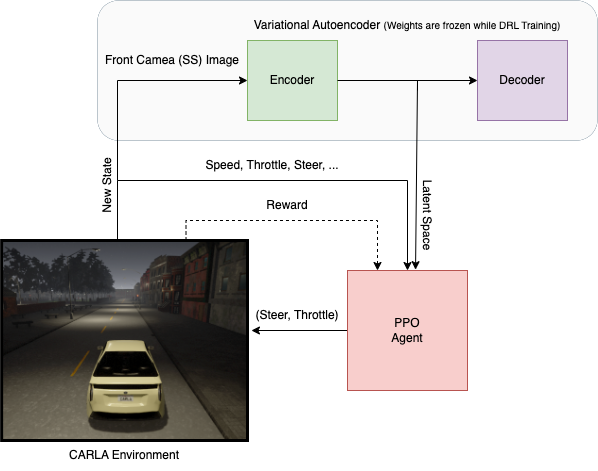

# <p align="center"> Deep Reinforcement Learning for Autonomous Driving </p>

Artificial Intelligence (AI) is advancing rapidly across multiple domains, and autonomous driving is one of its most exciting applications. In this project, we leverage **state-of-the-art Deep Reinforcement Learning (DRL)** techniques to train an agent capable of driving autonomously. To achieve this, we utilize [CARLA](http://carla.org/), an open-source urban driving simulator, which provides a realistic environment for experimentation and training.

Since deploying untested algorithms directly in the real world is unsafe and raises ethical concerns, we use CARLA as a safe testbed for developing and validating our models.

We specifically adopt **Proximal Policy Optimization (PPO)**, an on-policy DRL algorithm well-suited for continuous action spaces. PPO is trained to navigate through predefined routes in CARLA’s towns while avoiding collisions. To accelerate learning, we also integrate a **Variational Autoencoder (VAE)** to compress high-dimensional sensory input into a lower-dimensional latent space, making the agent’s learning process more efficient.

---

## About the Project

The aim of this work is to build an end-to-end pipeline for autonomous driving where the trained agent controls the vehicle to follow routes and minimize accidents. The project is divided into three main components:

1. CARLA Environment setup.
2. Variational Autoencoder (VAE).
3. Proximal Policy Optimization (PPO).

We use [CARLA 0.9.8](http://carla.org/) along with additional maps, focusing mainly on **Town 02** and **Town 07**. Results and analysis are summarized to demonstrate the approach and simplify understanding of this problem.

📄 Detailed documentation can be found [here](info/documentation/%5BThesis%20August%202025%5D%20IMPLEMENTING%20A%20DEEP%20REINFORCEMENT%20LEARNING%20MODEL%20FOR%20AUTONOMOUS%20DRIVING.pdf).

---

## Prerequisites

* [CARLA 0.9.8](https://github.com/carla-simulator/carla/releases) + Additional Maps (Town 02 & Town 07).
* Supported OS: **Windows** or **Linux**.
* **Python 3.7 (64-bit)**.

Copy additional maps into the CARLA directory to ensure a seamless experience.

---

## Project Setup

1. Clone this repository.
2. Create a virtual environment:

   ```bash
   python -m venv venv
   ```

   Activate it:

   * Windows: `venv\Scripts\activate`
   * Linux/Mac: `source venv/bin/activate`
3. Install dependencies:

   ```bash
   pip install -r requirements.txt
   ```
4. Additionally, install with Poetry:

   ```bash
   cd poetry/ && poetry update
   ```

Once setup is complete:

* Launch CARLA server (0.9.8).
* Run the client:

  ```bash
  python continuous_driver.py --exp-name ppo --train False
  ```

---

## Built With

* [Python](https://www.python.org/)
* [PyTorch](https://pytorch.org/)
* [CARLA Simulator](http://carla.org/)
* [Poetry](https://python-poetry.org/)
* [TensorBoard](https://www.tensorflow.org/tensorboard)

---

## Methodology

Our methodology combines three essential components:

1. CARLA Simulation Environment.
2. Variational Autoencoder (VAE).
3. PPO Agent.

<p align="center">  </p>
<p align="center"> Project Methodology Overview </p>

---

## Running the Project

### Run a Trained Agent

We provide pretrained PPO agents for **Town 02** and **Town 07** in:
`preTrained_models/PPO/<town>`

Run:

```bash
python continuous_driver.py --exp-name ppo --train False
```

Switch to Town 02:

```bash
python continuous_driver.py --exp-name ppo --train False --town Town02
```

### Train a New Agent

```bash
python continuous_driver.py --exp-name ppo
```

Checkpoints will be stored in:
`checkpoints/PPO/<town>/`
Metrics/logs in:
`logs/PPO/<town>/`

Monitor training with:

```bash
tensorboard --logdir runs/
```

---

## Variational Autoencoder (VAE)

We collected \~12,000 **160x80 semantic segmentation images** to train the VAE. The VAE encodes these high-dimensional inputs into a compact latent space, which is then fed into the PPO network.

Check reconstruction:

```bash
cd autoencoder && python reconstructor.py
```

<p align="center"> </p>
<p align="center"> Original vs Reconstructed Images </p>

---

## Project Architecture

<p align="center"> </p>
<p align="center"> VAE + PPO Training Pipeline </p>

---

## File Overview

| File/Folder                  | Description                                              |
| ---------------------------- | -------------------------------------------------------- |
| continuous\_driver.py        | Training/testing PPO agent                               |
| discrete\_driver.py          | Experimental Dueling DQN agent                           |
| encoder\_init.py             | Uses trained encoder to convert states into latent space |
| parameters.py                | Hyperparameters of the project                           |
| simulation/connection.py     | CARLA environment connection class                       |
| simulation/environment.py    | Main environment setup (Gym-style)                       |
| simulation/sensors.py        | Agent’s sensors setup                                    |
| simulation/settings.py       | Environment parameters                                   |
| runs/                        | TensorBoard logs and visualizations                      |
| preTrained\_models/ppo       | Pretrained PPO agents                                    |
| networks/on\_policy/agent.py | PPO agent implementation                                 |
| networks/on\_policy/ppo.py   | PPO network code                                         |
| logs/                        | Metrics/logs from training                               |
| info/                        | Figures, diagrams, documentation                         |
| checkpoints/                 | Model checkpoints                                        |
| carla/                       | CARLA `.egg` file for Python API                         |
| autoencoder/                 | VAE training and reconstruction code                     |

----
## Authors

* **Om Choksi** – [GitHub](https://github.com/omchoksi108)
* **Devang Dhandhukiya** – [GitHub](https://github.com/DEVANG0876)

Captain, do you want me to make this in **Markdown README.md format** (with styling preserved) so you can directly drop it into your GitHub repo?
